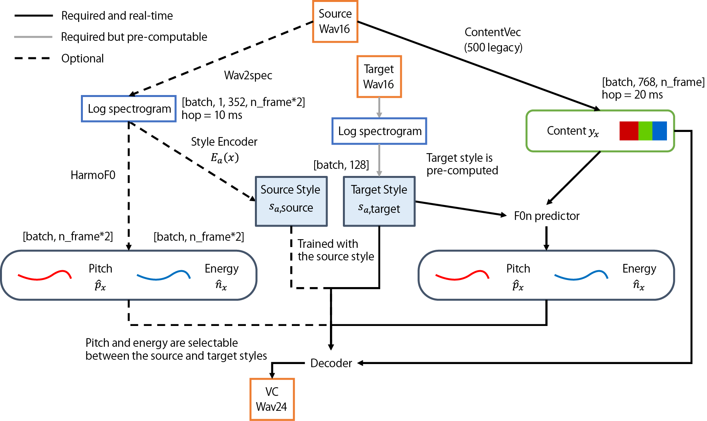

# ClassicVC

Lyodos (Lyodos the City of the Museum)

<p align="center">
    
</p>

- [ClassicVC](#classicvc)
  - [About](#about)
  - [License](#license)
    - [Notice](#notice)
  - [Usage](#usage)
  - [Pre-trained weight](#pre-trained-weight)
    - [ONNX](#onnx)
    - [PyTorch](#pytorch)
    - [Hash](#hash)

## About

ClassicVC **(Continuous LAtent-Space-based Style Inference with Content for Voice Conversion)** は連続潜在空間ベースの any-to-any voice conversion の研究を目的として、
概念実証のために試作された声質変換モデルです。PyTorch で開発されています。

GUI として [MMCXLI](https://github.com/lyodos) が用意されています。
MMCXLI を使って VC を試したいだけであれば、PyTorch の導入は不要です。本リポジトリで公開されている、
[ONNX 形式に変換したネットワーク](#onnx)をダウンロードしてください。
継続学習や ClassicVC モデル自体の改造が必要な方のみ、PyTorch 用のモデルをダウンロードしてください。

ClassicVC is an any-to-any voice conversion model that enables users to make up speaker styles by selecting the coordinates from the continuous latent spaces. The model components are implemented using PyTorch and fully compatible with ONNX.

[MMCXLI](https://github.com/lyodos) provides the dedicated graphical user interface (GUI) for ClassicVC. It runs on wxPython and ONNX Runtime. Users can [download the ONNX network files](#onnx) and try out speech conversion without having to install PyTorch or train a model with their own voice data.

***使用方法が分からないといった問い合わせや、取材にはいっさい応じません。***

----

## License

ClassicVC は開発者である Lyodos の著作物です。
ClassicVC is the work of Lyodos, the developer.

以下の各パッケージに由来するソースコードの改変物を含みます。
The code also contains modified versions of the following packages:

* https://github.com/WX-Wei/HarmoF0 (MIT License)

* https://github.com/yl4579/StyleTTS2 (MIT License)

* https://github.com/pseeth/torch-stft (The 3-Clause BSD License)

`model` ディレクトリ内のソースファイルごとに、改変元となったパッケージの情報および改変内容を記載しています。
元パッケージの作者が付したライセンスの条文については、各ソースファイルの冒頭に記載しております。
The license terms specified by the authors of the original packages are listed at the beginning of each source file, if exists.

ClassicVC リポジトリの構成物は、特記なき場合 MIT License でリリースされます。
ただし `/model/harmof0/conv_stft.py` のみ、元リポジトリのライセンスに従い the 3-Clause BSD License でリリースされます。
The components of the ClassicVC repository are released under the MIT License unless otherwise noted.
Exceptionally, `/model/harmof0/conv_stft.py` is released under the 3-Clause BSD License in accordance with the license of the original repository.

>The MIT License
>
>Copyright (c) 2024 Lyodos
>
>Permission is hereby granted, free of charge, to any person obtaining a copy of this software and associated documentation files (the "Software"), to deal in the Software without restriction, including without limitation the rights to use, copy, modify, merge, publish, distribute, sublicense, and/or sell copies of the Software, and to permit persons to whom the Software is furnished to do so, subject to the following conditions:
>
>The above copyright notice and this permission notice shall be included in all copies or substantial portions of the Software.
>
>THE SOFTWARE IS PROVIDED "AS IS", WITHOUT WARRANTY OF ANY KIND, EXPRESS OR IMPLIED, INCLUDING BUT NOT LIMITED TO THE WARRANTIES OF MERCHANTABILITY, FITNESS FOR A PARTICULAR PURPOSE AND NONINFRINGEMENT. IN NO EVENT SHALL THE AUTHORS OR COPYRIGHT HOLDERS BE LIABLE FOR ANY CLAIM, DAMAGES OR OTHER LIABILITY, WHETHER IN AN ACTION OF CONTRACT, TORT OR OTHERWISE, ARISING FROM, OUT OF OR IN CONNECTION WITH THE SOFTWARE OR THE USE OR OTHER DEALINGS IN THE SOFTWARE.
>
>以下に定める条件に従い、本ソフトウェアおよび関連文書のファイル（以下「ソフトウェア」）の複製を取得するすべての人に対し、ソフトウェアを無制限に扱うことを無償で許可します。これには、ソフトウェアの複製を使用、複写、変更、結合、掲載、頒布、サブライセンス、および/または販売する権利、およびソフトウェアを提供する相手に同じことを許可する権利も無制限に含まれます。
>
>上記の著作権表示および本許諾表示を、ソフトウェアのすべての複製または重要な部分に記載するものとします。
>
>ソフトウェアは「現状のまま」で、明示であるか暗黙であるかを問わず、何らの保証もなく提供されます。ここでいう保証とは、商品性、特定の目的への適合性、および権利非侵害についての保証も含みますが、それに限定されるものではありません。作者または著作権者は、契約行為、不法行為、またはそれ以外であろうと、ソフトウェアに起因または関連し、あるいはソフトウェアの使用またはその他の扱いによって生じる一切の請求、損害、その他の義務について何らの責任も負わないものとします。

### Notice

リアルタイム声質変換は、個人の属性を縛る代表的な枷の一つである「声色」から人類を解放することで、自己実現や人権保護に多大な貢献が期待される技術です。この技術の到来を切実に求める人々が存在しており、私たちはその声に応えるべく夜な夜な活動しています。
しかしながらディープフェイクや詐欺等への悪用が潜在的に可能な、いわゆるデュアルユース技術でもあり、使用には責任が伴います。
本リポジトリの構成物の全てもしくは一部を利用した時点で、ユーザーは上記の MIT License（`/model/harmof0/conv_stft.py` のみ the 3-Clause BSD License）を受諾し、その定めるところである作者の無制限の免責に同意したものとみなされます。

本プログラムは声質変換の基礎研究の一環として趣味で試作されたものであり、動作の確実性やリアルタイム性をいっさい保証しません。現時点では残念ながら実用段階に達しておらず、ソースコードの公開によってコミュニティでの検証を受けるべきであると、開発者は認識しています。インターネット配信等の不特定多数を対象とする場面での使用および、医療・交通・インフラ・兵器システム等を含むミッションクリティカルな用途については、明文化された唯一の規約として MIT License を採用する以上、開発者として禁止はできませんが積極的な推奨もしません。

ClassicVC の Python 環境上での実行時に、動的に読み込まれる外部ライブラリには、各ライブラリの開発者が別途定めるライセンスが適用されます。

***使用方法が分からないといった問い合わせや、取材にはいっさい応じません。***

Version 1.0.0 の公開後、このリポジトリは縮小営業に入ります。新たな機能は追加しない予定です。
また環境依存のバグについてのマージには対応できない可能性が高いです。
機能上の要望がある方は、各自でフォークしてください。
MIT License の定めるところにより、ユーザーは原開発者以外の者に、有償無償を問わずプログラムの改良を依頼することができます（要するに他でやってくれということです）。

----

## Usage

> ユーザーは Python および Jupyter Notebook の使用方法に熟達しているものと仮定します。

このリポジトリをクローンしてください。

Clone this repository.

```bash
git clone https://github.com/lyodos/classic-vc.git
cd classic-vc
```

Python 環境で "requirements.txt" に記載されているパッケージをインストールしてください。

Install the python packages listed in the requirements.txt.

その後、以下の Notebook に従って導入してください。

Follow the instruction as the following Notebooks (in Japanese).

Notebook 01 [ClassicVC_01_model.ipynb](./notebooks/ClassicVC_01_model.ipynb)

Notebook 02 [ClassicVC_02_dataset.ipynb](./notebooks/ClassicVC_02_dataset.ipynb)

Notebook 03 [ClassicVC_03_train.ipynb](./notebooks/ClassicVC_03_train.ipynb)

Notebook 04 [ClassicVC_04_contentvec_to_transformers.ipynb](./notebooks/ClassicVC_04_contentvec_to_transformers.ipynb)

Notebook 05 [ClassicVC_05_save_ONNX.ipynb](./notebooks/ClassicVC_05_save_ONNX.ipynb)

***使用方法が分からないといった問い合わせや、取材にはいっさい応じません。***

----

## Pre-trained weight

### ONNX 

[MMCXLI 経由で VC を使う大多数のユーザー](https://github.com/lyodos/mmcxli/README.md#checkpoints)は、以下のテーブルにある 7 つのファイル（拡張子が .onnx）だけダウンロードすれば十分です。
PyTorch の環境構築および .pth ファイルのダウンロードは不要です。

| Name | Size | Epoch | Hugging Face DL Link |
| ---- | ---- | ---- | ---- |
| harmof0.onnx | 5.93 MB | 1000 | https://huggingface.co/Lyodos/classic-vc/resolve/main/harmof0.onnx |
| hubert500.onnx | 378 MB | 1000 | https://huggingface.co/Lyodos/classic-vc/resolve/main/hubert500.onnx |
| style_encoder_304.onnx | 185 MB | 1000 | https://huggingface.co/Lyodos/classic-vc/resolve/main/style_encoder_304.onnx |
| f0n_predictor_hubert500.onnx | 121 MB | 1000 | https://huggingface.co/Lyodos/classic-vc/resolve/main/f0n_predictor_hubert500.onnx |
| decoder_24k.onnx | 222 MB | 1000 | https://huggingface.co/Lyodos/classic-vc/resolve/main/decoder_24k.onnx |
| pumap_encoder_2dim.onnx | 4.47 MB | - | https://huggingface.co/Lyodos/classic-vc/resolve/main/pumap_encoder_2dim.onnx |
| pumap_decoder_2dim.onnx | 17.2 MB | - | https://huggingface.co/Lyodos/classic-vc/resolve/main/pumap_decoder_2dim.onnx |

### PyTorch

以下は開発者向けです。

| Name | Size | Epoch | Hugging Face DL Link |
| ---- | ---- | ---- | ---- |
| style_encoder.pth | 93 MB | 1000 | https://huggingface.co/Lyodos/classic-vc/resolve/main/style_encoder.pth |
| f0n_predictor.pth | 121 MB | 1000 | https://huggingface.co/Lyodos/classic-vc/resolve/main/f0n_predictor.pth |
| decoder.pth | 222 MB | 1000 | https://huggingface.co/Lyodos/classic-vc/resolve/main/decoder.pth |

* HarmoF0 の重みはこのリポジトリに含まれており、変換器の初期化時に自動でロードされるのでダウンロードは不要です。

* ContentVec の重みは元実装のリポジトリから入手してください。

### Hash

第三者が設置したミラーから重みをダウンロードした場合、以下でファイルの真正性を確認してください。

```bash
$ sha256sum style_encoder.pth
e48589de17eb2f8f73443326aeac59bb2f9eba6e0b863f4082088539847c01f1 *style_encoder.pth

$ sha256sum f0n_predictor.pth
86f39b7d3a0cd372d49d2f8b9b78b71c1e604e07ffd222c3eee6b80339d3a60b *f0n_predictor.pth

$ sha256sum decoder.pth
7bb0cfee897db21f5f93e7281e3e899ab11634e5a592e0c1841e1f5766620622 *decoder.pth


$ sha256sum harmof0.onnx
70cd52c9b6c0996d3bdbd34c481468c53a5398a72009c574c9da818dad225bee *harmof0.onnx

$ sha256sum hubert500.onnx
579bf7e47836f2c38e1bd540897739e4355133817b2d8b49d929e35ef7147794 *hubert500.onnx

$ sha256sum style_encoder_304.onnx
b411c05af582a8edc044bdad27c5ec17076c967e3490462ffc1e0b466b9be446 *style_encoder_304.onnx

$ sha256sum f0n_predictor_hubert500.onnx
a64ca933988ff4d11576607c33bb2187e42c4c710c1c662456c00242b2c56109 *f0n_predictor_hubert500.onnx

$ sha256sum decoder_24k.onnx
4dce554bd88aff4fb1ea401bf9307756fe6bb0b615c73d94ef9dcfb91501bfbb *decoder_24k.onnx


$ sha256sum pumap_encoder_2dim.onnx
1fb9002055ca298c3139b7119edc919243bed20bf688d0aeb58f2fd727600cd2 *pumap_encoder_2dim.onnx

$ sha256sum pumap_decoder_2dim.onnx
c4f2f1f3b952dd5747a667b14ed4b73e4b03a5fd68c082b195b6668b4540b1cc *pumap_decoder_2dim.onnx

```
